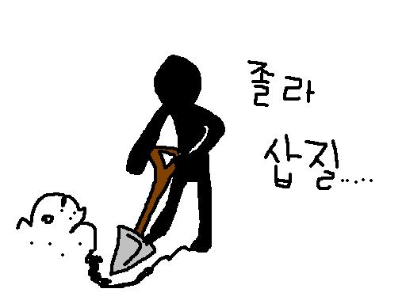

# SOLID 튜토리얼

`SOLID` 원칙은 소프트웨(SW, Software)공학에서 반드시 다루는 주제입니다.

만약 여러분이 자바(Java), 피이썬(Python), C++ 같은 객체지향(Object Oriented) 언어를 공부하거나 사용하고 있다면 피해 갈 수 없으며, 숙명적으로 만나야 하는 내용입니다. 본인이 피하고 싶다고 피할 수 있는 내용이 아닙니다.

`SOLID`는 객체지향 설계 (`OOD`: Object Oriented Design) 또는 객체지향 프로그래밍 (`OOP`: Obeject Oriented Programming)에서 반드시 알아야 하는 5가지 원칙을 말합니다.

튜토리얼과 관련된 문서, 소스코드, 유튜브 동영상 링크 정보는 다음과 같습니다.

## SOLID 튜토리얼 세부 정보

|순번|제목|웹 문서|소스코드|Youtube 링크|
|:---|:---|:---:|:---|:---|
|-|유튜브 동영상 목록 보기|없음|없음|유튜브 [목록 보기](https://www.youtube.com/playlist?list=PLRUS1nW-CfncWwWByDX-MRHZvJJwE-oz7)|
|0|Overview (훑어보기)|없음|없음|유튜브 [바로가기](https://youtu.be/59vNT83fcTA)|
|1|**S** : 단일 책임 원칙 (SRP)|[Click](./docs/01_solid-srp.md)|SRP 적용 전 [Click](./codes/01_01_solid-tutorial-srp-before.py)  SRP 적용 후 [Click](./codes/01_02_solid-tutorial-srp-after.py)|유튜브 [바로가기](https://youtu.be/dzsmyn40FoM)|
|2|**O** : 개방 폐쇄 원칙  (OCP)|[Click](./01_01_intro_to_mermaid.md)|OCP 적용 전 [click](./codes/02_01_solid-tutorial-ocp-before.py)  OCP 적용 후 [click](./codes/02_02_solid-tutorial-ocp-after.py) |유튜브 [바로가기](https://youtu.be/2sYPFJS2HzY)|
|3|**L** : 리스코프 교체 원칙  (LSP)|[Click](./01_01_intro_to_mermaid.md)|LSP 적용 전 [click](./codes/03_01_solid-tutorial-lsp-before.py)  LSP 적용 후 [click](./codes/03_02_solid-tutorial-lsp-after.py)|유튜브 [바로가기](https://youtu.be/ebTdQrCGXvg)|
|4|**I** : 인터페이스 분리 원칙  (ISP)|[Click](./01_01_intro_to_mermaid.md)|ISP 적용 전 [click](./codes/04_01_solid-isp-before.py)  ISP 적용 후 (상속 활용) [click](./codes/04_02_solid-isp-after-inheritance.py)  ISP 적용 후 (합성 활용) [click](./codes/04_03_solid-isp-after-composition.py) |유튜브 [바로가기](https://youtu.be/eU2Gx-0TwPk)|
|5|**D** : 의존관계 역전 원칙  (DIP)|[Click](./01_01_intro_to_mermaid.md)| DIP 적용 전 [click](./codes/05_01_solid_dip_before.py)   DIP 중간 단계 [click](codes/05_02_solid_dip_intermediate.py)   DIP 적용 후 [click](codes/05_03_solid_dip_after.py) |유튜브 [바로가기](https://youtu.be/riZjLpvO8xk)|
|6|참고자료1 : 연관 및 의존관계 설명|[Click](./docs/relationship-association-vs-dependency.md)|없음|없음|
|7|참고자료2 : 강의 슬라이드 (pdf)|[Click](./SOLID_principals.pdf)|없음|없음|
||||||

## SOLID 원칙을 알아야 하는 이유

SW 기술이 눈부시게 발전하면서 SW 개발 언어도 개발자의 요구에 따라 빠르게 진화하고 있습니다. 이는 SW를 효율적으로 개발하고 유지보수 할 수 있다는 점에서 상당히 좋은 현상입니다.

하지만, 다양한 기능들이 추기되면서 SW 개발 언어는 점점 더 복잡해지고 다양해 졌습니다.

SW 기술 발전으로 개발/유지보수에 편리한 점도 많지만, 역설적으로 개발 및 유지보수가 어려워지는 단점도 같이 존재하게 되었습니다.

저는 `삽질` 이라는 표현을 자주 사용합니다.

이미지 출처: 블로그 게시글 ["진짜 개삽질, 파이썬 3 ..."](https://blog.naver.com/PostView.nhn?blogId=nackji80&logNo=221263224490&parentCategoryNo=&categoryNo=54&viewDate=&isShowPopularPosts=true&from=search)

SW 개발에서 삽질이란 `뭔가를 몰라서` 또는 `굳이 안해도 되는` 것에 해당되는 경우에 추가적/부가적으로 해야하는 작업입니다. 

SW 개발 과정에서 삽질의 예는 이렇습니다. 

버그가 발생해서 수정해야 하는데 `버그 잡는 방법을 몰라서` 며칠 밤을 새는 일이라던가, 잘 돌아가는 SW를 바꿔 달라는 `굳이 안해도 될 것 같은 수정 작업`을 위해 며칠 추가 작업을 해야 하는 일 등이 있습니다.

하지만 이런 삽질은 피할 수 없겠죠? SW 기술이 발전하다 보니 끊임없이 내가 모르는 것이 나타날 것이고, 사람의 요구는 끊임없이 변하는 것이니 기존에 멀쩡하게 돌아가던 SW를 수정해야 할 일은 인간이 존재하는 한 계속해서 발생할 것입니다.

이런 모든 상황은 `변화`로부터 발생합니다. `기술변화`, `요구변화`, `환경변화`과 같은 것들입니다. 개발자에게 변화는 좋든 싫든 삽질을 유발합니다. 몸도 마음도 힘들어지는 것입니다. 

그렇다고 모든 변화로부터 오는 삽질을 모두 개발자가 감내해야 할까요? 그건 아닐 겁니다.

변화는 피할 수 없더라도, 변화에 따른 삽질은 최소화 해야 겠죠? 

삽질을 최소화하기 위한 오랜 기간의 노력과 지식이 체계적으로 정리된 것이 `SOLID` 원칙입니다. `SOLID` 원칙은 특히 OOP/OOD에서 매우 강력한 힘을 발휘합니다.

삽질을 줄여준다는데 우리가 공부하거나 사용하지 않을 이유는 전혀 없습니다.

앞에서 제시한 SOLID 튜토리얼 세부 정보 표에 따라서 공부하면 좋습니다. 

유튜브 동영상을 먼저 시청하고, 부족하면 해당 문서를 열어보면 조금 더 자세한 내용을 확인할 수 있습니다. 깃허브 레파지토리(repo)의 경우 `docs` 폴더를 참고하기 바랍니다.

SOLID 원칙을 실습하는데 사용했던 모든 파일 링크는 위 표에 정리하였습니다. 깃허브 repository의 경우는 `codes` 폴더를 참고하기 바랍니다.

이제부터 차근차근 **SOLID** 원리와 활용 방법에 대해 살펴보시기 바랍니다.

