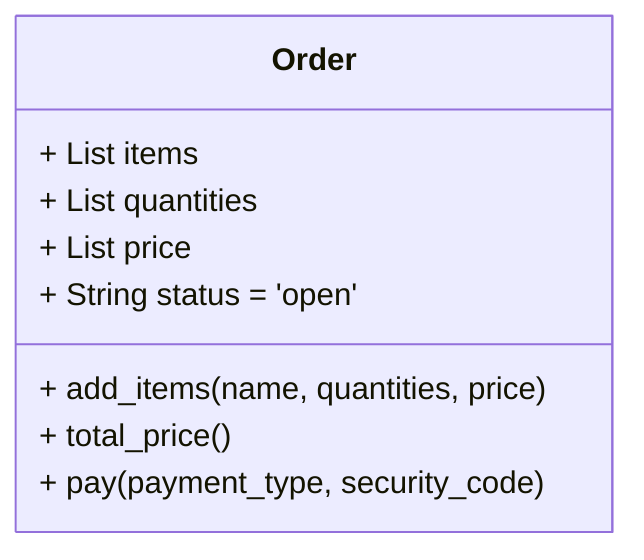
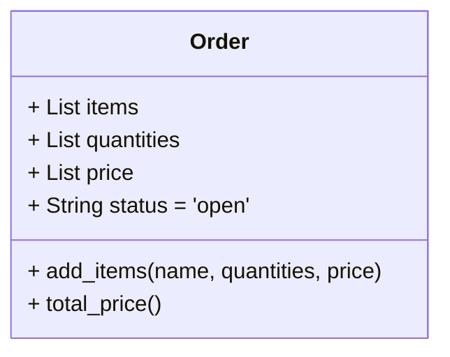
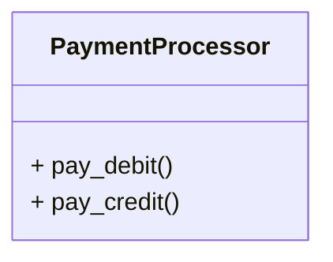

# 단일 책임 원칙 (SRP)

단일 책임 원칙 (SRP: Single Responsibility Principle)은 모든 클래스는 단 하나의 책임만을 갖는다는 원칙입니다.

주문과 관련된 클래스를 다음과 같이 설계하였다고 가정해 봅니다.



위 클래스는 상픔을 주문(`order`)했을 경우 해당하는 클래스를 설계한 것입니다. 

기본 속성 `item`, `queantities`, `price`, `status` 모두 주문(`order`)와 관련된 클래스 입니다.
- 하나의 클래스에 2개의 책임이 존재
  - 주문(`Order`)와 관련한 책임: `add_items()`, `total_price()`
  - 결재(`pay`)와 관련된 책임: `pay()`

따라서 2개의 클래스로 분리하는 것이 좋습니다.

주문을 담당하는 기존의 `Order` 클래스에서 결재를 담당하는 `PaymentProcessor` 클래스를 분리하였습니다.

2개의 클래스로 분리한 결과는 다음과 같습니다.





각각의 클래스를 Python으로 구현한 코드는 다음과 같습니다.

- `Order` 클래스

  ```python
  class Order:
      def __init__(self):
          self.items = []
          self.quantities = []
          self.prices = []
          self.status = "open"

      def add_item(self, name, quantity, price):
          self.items.append(name)
          self.quantities.append(quantity)
          self.prices.append(price)

      def total_price(self):
          total = 0
          for i in range(len(self.prices)):
              total += self.quantities[i] * self.prices[i]
          return total
  ```

- `PaymentProcessor` 클래스
  
  ```python
  class PaymentProcessor:
    def pay_debit(self, order, security_code):
        print("Processing debit payment type")
        print(f"Verifying security code: {security_code}")
        order.status = "paid"

    def pay_credit(self, order, security_code):
        print("Processing credit payment type")
        print(f"Verifying security code: {security_code}")
        order.status = "paid"
  ```