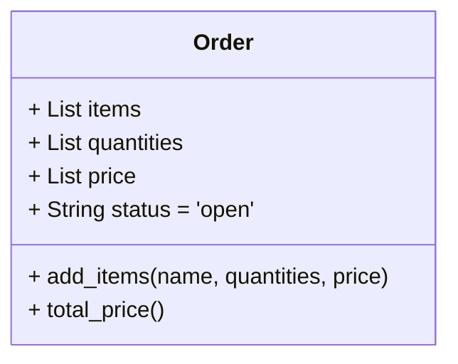
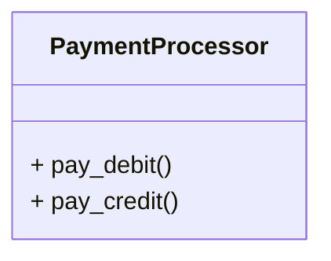
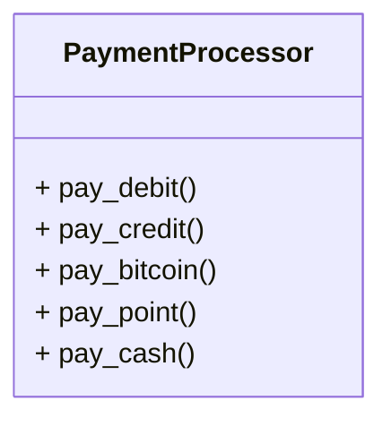
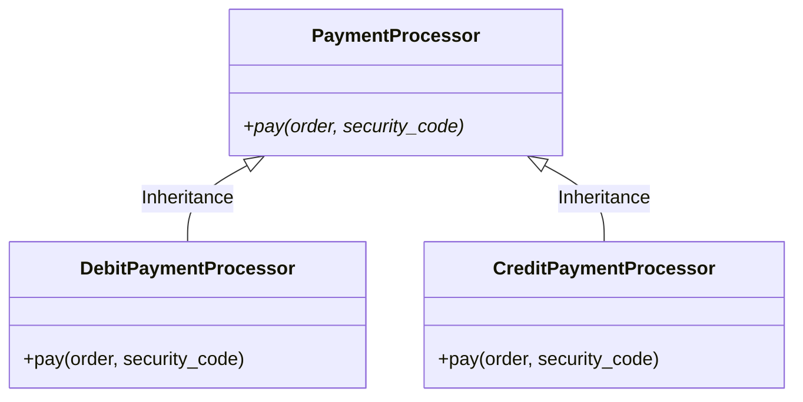
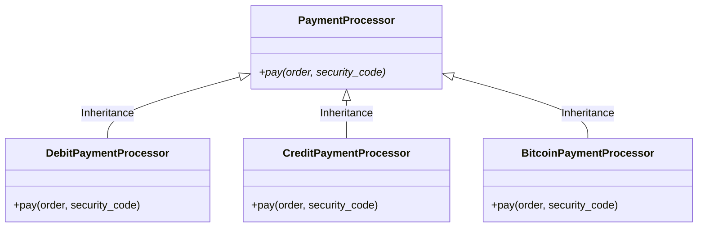

# 개방 폐쇄 원칙 (OCP)

개방 폐쇄 원칙은 Bertrand Meyer(1995~, France)가 'Object Oriented Software Construction (1998)'이라는 책에서 정의한 내용입니다.

    
    
Bertrand Meyer(1995~, France)

객체지향 설계에서 개방 폐쇄 원칙(OCP: Open Close Principle)은 모든 클래스는 확장에는 열려(open) 있어야 하고 수정(변경)에는 닫혀(close) 있어야 한다는 원칙입니다. 앞으로는 줄여서 `OCP`로 부르도록 하겠습니다.

소프트웨어 개발자를 괴롭히는 원인 중 하나는 변경에 따른 수정작업 입니다. 발주자나 사용자들은 어렵게 소프트웨어를 설계하고 구현(코딩)을 마쳤는데 이만저만 해서 고쳐달라는 상황이 발생하는 것입니다. 

즉 상황변화에 따른 변경이 발생하고, 이에 따른 재작업이 필요한 것입니다.

이러한 상황 변화 요소가 잘 정리되어서 한번에 처리할 수 있다면 좋겠지만, 현실은 그렇지 않습니다. 상황 변화가 발생하는 시점이 미리 정해지지 않기 때문입니다.

더 큰 문제는 하나의 클래스를 변경 했더니 다른 부분의 소스코드까지 같이 수정해야 하는 연쇄 작업이 변경하는 상황입니다.

이러한 상황이 자주 발생하면 개발자는 더 많은 시간과 노력을 들여야 하고, 프로젝트 진행 관점에서는 일정이 지연되고 비용이 상승하는 부작용이 있습니다.

수많은 삽질을 경험한 개발자들이 이러한 상황을 보고 있지만은 않았습니다. 결국 이러한 상황을 최소화 하고자 하는 접근 방법이 등장했는데 바로 `개방 폐쇄 원칙 (OCP)` 입니다. 

## OCP 접근법

OCP는 2가지 설계 철학이 담겨져 있습니다.
1. 개발자는 환경 변화에 따른 수정을 막을 수는 없지만, 수정을 하더라도 기존에 만들어 놓은 클래스를 수정하지 않도록 하자!
2. 환경 변화에 따른 수정이 발생하더라도 기존 클래스를 재활용하여 쉽게 구현하도록 하자!

OCP는 객체지향설계의 핵심 메커니즘이며, 추상화 및 다형성이 핵심 기술입니다.

OCP의 접근 방법은 다음과 같습니다.
1. 변하지 않는 것과 변하게 될 것을 모듈로 구분한다.
2. 이러한 모듈들이 만나는 지점에 인터페이스를 정의한다.
3. 인터페이스에서 정의한 대로 구현(코딩)한다.

## OCP 실습 - 문제점 확인

[단일 책임 원칙](./01_solid-srp.md)에서 다루었던 예제를 다시 한번 살펴보겠습니다.

우리는 SRP 원칙을 준수하기 위해 상품 주문(`Order`) 클래스를 2개의 클래스 주문(`Order`)과 결재(`PaymentProcessor`)로 분리하였습니다.

위에서 살펴본 `Order` 클래스는 변화에 큰 영향이 없을 것 같습니다. 하지만, `PaymentProcessor` 클래스는 걱정이 됩니다. 

현재는 직불카드를 이용한 지불방법 `pay_debit()`, 신용카드를 이용한 지불방법 `pay_credit()`을 구현했지만 비트코인과 같은 가상화폐를 추가해야 할 수도 있고, 회사 정책에 따라 적립 포인트를 이용한 지급이 추가될 수 있습니다. 사용자 요구에 따라 현금 지불 기능을 추가해야 할 경우도 있습니다.

이럴 때마다 항상 `PaymentProcessor`를 수정해 주어야 합니다.

다음과 같이 간단하게 결재 방법을 추가하면 큰 문제가 없다고 생각할 수도 있습니다.

하지만 이런 방법은 OCP 원칙에 정면으로 위배됩니다. 어떤 변화가 생길 때마다 `PaymentProcessor`를 항상 수정해야 하기 때문입니다. 

이런 접근법은 여러가지 문제점과 위험 요소를 가지고 있습니다. 

- 신용카드를 통해 결재하고 싶은 사용자가 `PaymentProcessor` 객체를 호출한 경우 불필요한 다른 지불 방법까지 접근할 수 있게되어 지불 오류가 발생할 수 있습니다.
- 소프트웨어 설계상으로 단순한 구조로 보일지 모르지만 구현 과정에서 기존에 구현해 놓은 기능을 실수로 건드릴 수도 있습니다. 
- `PaymentProcessor`를 사용하는 다른 클래스와 많은 의존성이 생길 수 있습니다.
  - 이런 경우 `"결합도(Coupling)가 높아진다"`라고 표현합니다.
- `PaymentProcessor` 내부에 서로 관련이 없는 지불 방법을 하나로 묶어 놓았기 때문에 구성 요소들간에 연관성이 떨어집니다.
  - 이런 경우 `"응집도(Cohesion)가 낮아진다"`라고 표현합니다.

## OCP 실습 - 해결 방법

앞서 설명했던 OCP의 접근 방법을 차근차근 따라가면 해결 방법을 얻을 수 있습니다.
1. 변하지 않는 것과 변하게 될 것을 모듈로 구분한다.
2. 이러한 모듈들이 만나는 지점에 인터페이스를 정의한다.
3. 인터페이스에서 정의한 대로 구현(코딩)한다.

먼저 변하지 않는 것을 살펴볼까요?

`PaymentProcessor`의 지불(`pay`) 기능은 변하지 않을 것입니다. 직불카드/신용카드/비트코인/현금/포인트 등과 같은 모든 방법은 지불(`pay`) 이라는 기본 기능을 갖게 됩니다. 미래 환경이 많이 바뀐다고 하더라도, 다른 어떤 것이 추가되더라도 웬만하면 유지될 기능입니다.

변하게 될 것은 무엇일까요?

맞습니다. 지불 수단은 변하게 될 것입니다. 지불 수단은 기술 발전이나 사회 변화에 따라 추가되기도 하고 삭제되기도 할 것입니다.

그렇다면 `PaymentProcessor`를 추상 클래스로 만들고, 각각의 지불 수단은 추상 클래스를 상속받아서 구현하면 됩니다. 추상 클래스는 구현해야 할 메서드만 정의한 클래스 입니다. 추상 클래스의 실제 구현은 추상 클래스를 상속받은 클래스가 담당합니다.

추상 클래스를 이용하여 직불카드와 신용카드를 별개의 클래스로 구현하면 다음과 같습니다.

위와 같은 구조에서 비트코인이 새로운 지불 방법으로 추가하는 변경을 한다고 하더라도 기존 코드는 아무것도 신경쓰지 않아도 됩니다. `PaymentProcessor` 클래스를 상속받아 `BitcoinPaymentProcessor` 클래스를 하나 더 만들면 그만입니다. 

비트코인을 추가한다면 다음과 같은 구조가 될 것입니다.

위와 같이 코딩한다면 미래에 웬만한 지불 환경 변화에도 쉽게 대처할 수 있습니다.

## SOLID 튜토리얼 메인 페이지로 돌아가기 [Click](../README.md)
