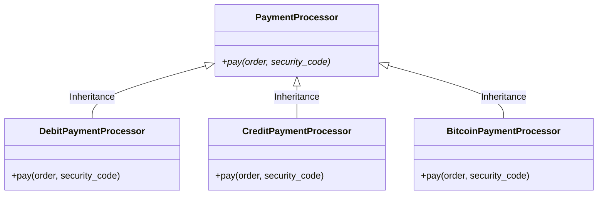
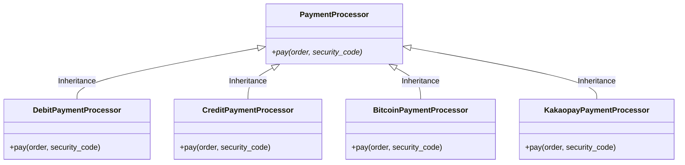
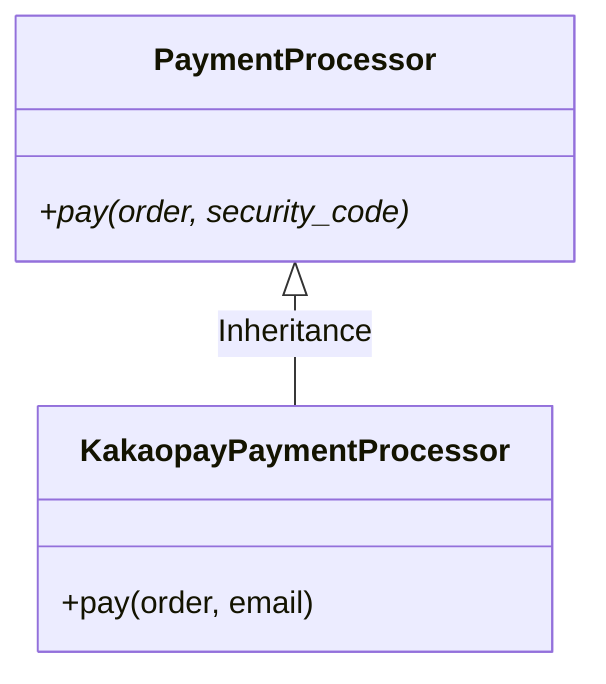

# 리스코프 교체 원칙 (LSP)


리스코프 교체 원칙(LSP: Liskov Substitution Principal)은 Babara Liskov(1939~, USA)가 개발한 객체지향 프로그래밍 원칙 중 하나입니다. 

Babara Liskov는 프로그래밍 언어 및 분산 컴퓨팅 분야의 선구자로 인정받고 있으며 MIT 교수로 재직 중입니다. 그녀는  이 공로를 인정받아 2008년 튜링상을 수상하였습니다.(그림 출처: [온라인 위키](https://en.wikipedia.org/wiki/Barbara_Liskov))


그녀는 1988년 컨퍼런스에서 'Data Abstraction and Hierachy'라는 주제의 Keynote 발표에서 리스코프 교체 원칙을 소개하였습니다. 리스코프 교체 원칙은 리스코프 치환 원칙으로 부르기도 합니다. 앞으로는 줄여서 `LSP`로 부르도록 하겠습니다.

때때로 LSP는 `Strong Behavioral Subtyping`이라는 용어로 불리기도 합니다. 

수학적 정의는 다음과 같습니다.

---
"*Subtype Requirement*: Let $\phi (x)$ be a property provable about objects $x$ of type $T$. 

Then $\phi (y)$ should be true for objects $y$ of type $S$, where $S$ is a subtype of $T$."

---

LSP는 SOLID 원칙 중에서 가장 이해하기 어려운 원칙입니다. 하지만 차근차근 읽다보면 마지막에는 쉽게 이해할 수 있습니다.

LSP를 이해하기 위한 걸음을 시작해 볼까요?

Liskov가 정의한 대로 해석하면 다음과 같습니다.

"서브 타입은 언제나 기반 타입으로 교체 가능해야 한다"는 의미입니다. 비슷한 뜻으로 "서브 타입은 언제나 기반 타입과 호환될 수 있어야 한다"는 의미입니다.


한국어로 번역하니 더욱 어려워 보입니다.

좀 더 쉽운 표현을 없을까요? 클래스 개념으로 보면 다음과 같이 풀이할 수 있습니다.

- "기반 클래스는 파생 클래스로 대체할 수 있어야 한다."
- "부모 클래스에 자식 클래스를 넣어도 문제 없어야 한다."

여전히 헷갈리나요? 실생활에서 예제를 찾아 볼까요?

아래 그림을 봅시다.


이미지 출처: 인터넷 블로그 [타키탸키님](https://velog.io/@tataki26/%EB%A6%AC%EC%8A%A4%EC%BD%94%ED%94%84-%EC%B9%98%ED%99%98-%EC%9B%90%EC%B9%99)

소프트웨어로 다양한 자동차를 구현하기 위해서는 기본이 되는 자동차 클래스를 만들고 그 클래스를 상속받아 여러 종류의 자동차를 만들게 됩니다. 

위 그림에서 자동차를 상속받아 스포츠카도 만들고 택시도 만들었습니다. 그런데 특이하게 자동차를 상속받아 헬리콥터도 만들었습니다.

개발자는 어떻게 자동차를 상속받아서 헬리콥터를 만들게 되었을까요?

아마도 그 개발자는 헬리콥터가 자동차와 같이 이동수단이고 지면에 닿는 부분이 공통적이라고 생각했기 때문일 것입니다. 자동차를 상속받아 바퀴 대신 헬리콥터 착륙장치로 오버라이딩 하고, 다른 여러 기능을 추가했을 것입니다. 하지만 헬리콥터는 자동차가 아니죠! 상속을 통해 구현은 가능하지만 `IS-A` 관계가 성립하지 않습니다. 자동차 클래스를 헬리콥터로 바꾼다면 전혀 작동하지 않을 것입니다.

이러한 상황을 LSP 위반 사례, 또는 LSP 미준수 사례라고 부릅니다.

## LSP 접근법

LSP 근간에는 객체지향설계(또는 객체지향프로그래밍)에 있어 가장 핵심이 되는 `상속을 통한 다형성`을 최대한 준수하기 위한 철학이 담겨져 있습니다.

다형성 활용을 통한 확장 효과를 얻기 위해서는 부모와 자식간에 `IS-A` 관계를 준수해야 합니다. `IS-A` 관계를 유지하지 못할 경우에는 `합성(Composition)` 구조를 사용하는 것이 좋습니다. 다형성을 통한 확장 효과를 최대화 하는 원칙이 바로 앞서 살펴본 [OCP 원칙](02_solid-ocp.md) 입니다.

결국 LSP는 OCP를 확실히 달성하기 위한 기본 구조가 됩니다.

부모 클래스의 속성과 메서드를 그대로 물려받는다면 LSP와 연관된 어떤 문제도 발생하지 않습니다.

LSP 위반 사례는 다음과 같은 경우에 발생합니다.
1. 오버라이딩(overriding) 과정에서 변수 타입 변경, 메서드 파라미터나 리턴값 변경
2. 부모 클래스의 의도와 다르게 메서드를 변경하는 오버라이딩

LSP를 위반한다고 생각할 경우 대처 방법은 다음과 같습니다.
1. 추상클래스 또는 인터페이스를 활용한다.
2. 두 객체가 하는 일이 다르다면 상속을 활용한다.
3. 객체가 하는 일에 따라,
   - 하는 일이 같으면: 하나의 클래스로 구성하고 구분 필드를 추가한다.
   - 하는 일이 다르면: 별개의 클래스로 구현한다.

## OCP 실습 - 문제점 확인

[개방 폐쇄 원칙](./02_solid-ocp.md)에서 다루었던 예제를 다시 한번 살펴보겠습니다.

우리는 OCP 원칙을 준수하기 위해 상품 주문(`Order`) 클래스를 2개의 클래스 주문(`Order`)과 결재(`PaymentProcessor`)로 분리하하고 `PaymentProcessor`를 상속받아 다양한 결재 형태를 구현하였습니다.
  


위 시스템을 운영하던 중에 다음과 같이 결재 방법에 대한 환경 변화가 생겼습니다. 

```사용자들은 카카오 페이를 이용한 결재 방법을 요청하고 있습니다.```

그래서 유지보수 개발자들은 `PaymentProcessor`를 상속받아 `KakaopayPaymentProcessor` 클래스를 만들기로 했습니다. SRP, OCP 원칙을 준수하며 개발했다면 손쉽게 확장이 가능합니다. 카카오 페이 결재를 추가한 결재 기능은 다음과 같을 것입니다.



그런데 약간의 문제가 발생했습니다.

카카오 페이는 비밀번호(`security_code`) 인증 대신에 이메일 인증이 필요하다고 가정해 봅니다.

이 상황에서 유지보수 개발자는 이렇게 생각할 수 있습니다.

```
음... 부모 클래스에서 추상 메서드를 통해 인증을 위한 인터페이스를 정해 두었구나! 인증 과정에서 `security_code`라는 파라미터를 사용하는 것이니 이것을 이메일로 오버라이딩 해서 활용하면 되겠군!!
```

그래서 다음과 같이 `KakaopayPaymentProcessor` 클래스의 상속 구조를 설정하였습니다.



자식 클래스에서 구현 책임이 있는 `pay` 메서드를 오버라이딩하여 파라미터 `security_code`를 `email`로 변경하였습니다.

그리고 내부 `pay` 메서드의 내부 구조도 다른 클래스와 다르게 약간 변경했습니다.

- `security_code`를 사용하는 클래스(`DebitPaymentProcessor`, `CreditPaymentProcessor`, `BitcoinPaymentProcessor`)의 `pay` 메서드 내부 구조

    ```python
    class DebitPaymentProcessor(PaymentProcessor):
        '''직불 카드를 이용한 주문 결재 처리기'''

        def pay(self, order, security_code):
            '''직불 카드 결재'''
            print("직불카드 결재를 시작합니다.")
            print(f"비밀번호 확인: {security_code}")
            print('결재가 완료되었습니다.')
            order.status = "paid"

    class CreditPaymentProcessor(PaymentProcessor):
        '''신용 카드를 이용한 주문 결재 처리기'''

        def pay(self, order, security_code):
            '''신용 카드 결재'''
            print("신용카드 결재를 시작합니다.")
            print(f"비밀번호 확인: {security_code}")
            print('결재가 완료되었습니다.')
            order.status = "paid"

    class BitcoinPaymentProcessor(PaymentProcessor):
        '''비트코인을 이용한 주문 결재 처리기'''

        def pay(self, order, security_code):
            '''비트코인 결재'''
            print("비트코인 결재를 시작합니다.")
            print(f"비밀번호 확인: {security_code}")
            print('결재가 완료되었습니다.')
            order.status = "paid"
    ```
- `email`을 사용하는 `KakaopayPaymentProcessor` 클래스의 `pay` 메서드 내부 구조
  
  ```python
  class KakaopayPaymentProcessor(PaymentProcessor):
    '''카카오 머니를 이용한 주문 결재 처리기'''

    def pay(self, order, email):
        '''카카오 머니 결재'''
        print("카카오 머니 결재를 시작합니다.")
        print(f"이메일 확인: {email}")
        print('결재가 완료되었습니다.')
        order.status = "paid"
  ```

`KakaopayPaymentProcessor` 클래스는 추상 클래스가 원래 의도했던 `security_code` 대신에 다른 파라미터(정보)를 이용하여 작동합니다.

이는 LSP 위반 사례에 해당합니다. 
1. 오버라이딩(overriding) 과정에서 변수 타입 변경하였습니다(`security_code` $\to$ `email`)
2. `security_code`를 사용하려던 부모 클래스 의도와 다르게 자식 클래스가 구현되었습니다.

LSP를 위반하였으니 OCP에도 영향을 주게 됩니다.

LSP를 준수할 수 있도록 수정해 볼까요?


## LSP 실습 - 해결 방법

앞서 살펴봤듯이 LSP를 위반한 경우 대처 방법은 다음과 같습니다.
1. 추상클래스 또는 인터페이스를 활용한다.
2. 두 객체가 하는 일이 다르다면 상속을 활용한다.
3. 객체가 하는 일에 따라,
   - 하는 일이 같으면: 하나의 클래스로 구성하고 구분 필드를 추가한다.
   - 하는 일이 다르면: 별개의 클래스로 구현한다.

이미 추상클래스를 이용해 구현한 상태이니 "1. 추상클래스 또는 인터페이스를 활용한다."는 신경쓰지 않아도 됩니다.

`KakaopayPaymentProcessor` 클래스는 기존 자식 클래스들과는 인증 과정이 약간 다르니 상속을 통해 구현하면 되겠습니다.

`KakaopayPaymentProcessor` 객체가 수행할 일은 기존 자식 클래스들이 하는 일과 동일하게 `결재`를 담당하게 되므로 "하나의 클래스로 구성하고 구분 필드를 추가한다."라는 방법을 따르면 되겠습니다. 구분 필드라는 내용이 약간 막연합니다. 우리는 클래스 초기화 함수 `inintializer`(`__init__`)를 이용해 보겠습니다.

우선 자식 클래스에서 의무적으로 구현해야 하는 `security_code`를 제거하기 위해 추상클래스 `PaymentProcessor`에서 `security_code`를 제거합니다. 제거한 이후의 추상클래스 `PaymentProcessor`는 다음과 같습니다.

```python
class PaymentProcessor(ABC):
    '''OCP 원칙 준수를 위한 추상 클래스'''

    # pay 메서드 파라미터 security_code 제거
    @abstractmethod
    def pay(self, order):
        pass
```

추상클래스 `PaymentProcessor` 메서드 `pay`에서 `security_code`를 제거하였으므로 모든 자식 클래스에서 `security_code`를 제거합니다. 그리고 각각의 자식 클래스는 자신에게 필요한 정보를 `__init__` 메서드를 이용해 구현합니다. 구현한 결과는 다음과 같습니다.

```python
class PaymentProcessor(ABC):
    '''OCP 원칙 준수를 위한 추상 클래스'''

    # pay 메서드 파라미터 security_code 제거
    @abstractmethod
    def pay(self, order):
        pass

class DebitPaymentProcessor(PaymentProcessor):
    '''직불 카드를 이용한 주문 결재 처리기'''

    def __init__(self, security_code):
        self.security_code = security_code

    def pay(self, order):
        '''직불 카드 결재'''
        print("직불카드 결재를 시작합니다.")
        print(f"비밀번호 확인: {self.security_code}")
        print('결재가 완료되었습니다.')
        order.status = "paid"

class CreditPaymentProcessor(PaymentProcessor):
    '''신용 카드를 이용한 주문 결재 처리기'''

    def __init__(self, security_code):
        self.security_code = security_code

    def pay(self, order):
        '''신용 카드 결재'''
        print("신용카드 결재를 시작합니다.")
        print(f"비밀번호 확인: {self.security_code}")
        print('결재가 완료되었습니다.')
        order.status = "paid"

class BitcoinPaymentProcessor(PaymentProcessor):
    '''비트코인을 이용한 주문 결재 처리기'''

    def __init__(self, security_code):
        self.security_code = security_code

    def pay(self, order):
        '''비트코인 결재'''
        print("비트코인 결재를 시작합니다.")
        print(f"비밀번호 확인: {self.security_code}")
        print('결재가 완료되었습니다.')
        order.status = "paid"

class KakaopayPaymentProcessor(PaymentProcessor):
    '''카카오 머니를 이용한 주문 결재 처리기'''

    def __init__(self, email):
        self.email = email

    def pay(self, order, email):
        '''신용 카드 결재'''
        print("카카오 머니 결재를 시작합니다.")
        print(f"이메일 확인: {self.email}")
        print('결재가 완료되었습니다.')
        order.status = "paid"
```

위 코드를 실행하는 코드도 아래와 같이 약간 바뀌게 됩니다.

```python
if __name__=='__main__':
    # Order 객체 생성 및 실행
    order = Order()
    order.add_item("Keyboard", 1, 50)
    order.add_item("SSD", 1, 150)
    order.add_item("USB cable", 2, 5)
    print(f'결재 금액은 {order.total_price()} 입니다.')

    # KakaopayPaymentProcess 객체 생성 및 실행
    processor = KakaopayPaymentProcessor("abc@company.com")
    processor.pay(order)
```

위와 같이 구현하면 부모 클래스가 본래 의도했던 모든 것이 자식 클래스에서 구현되었습니다. 부모 클래스를 어떤 자식 클래스로 대체(치환)하여도 문제없이 작동됩니다.

이제 우리는 코드 수정을 통해 LSP 원칙을 준수하게 되었습니다.
