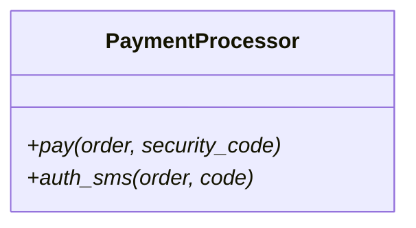
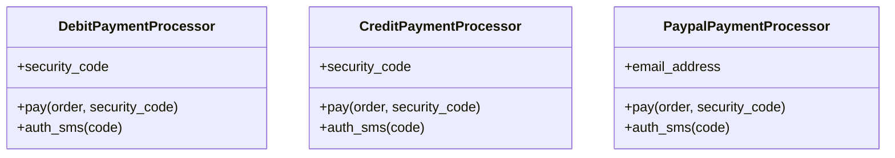
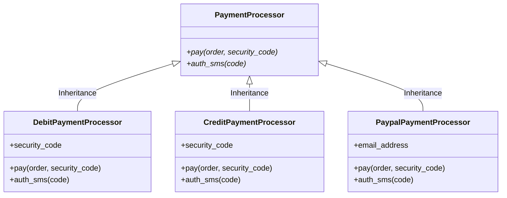
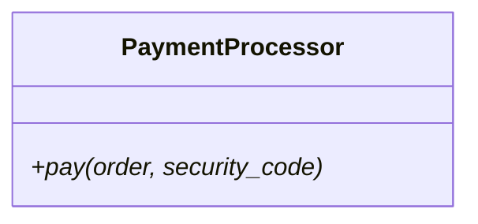
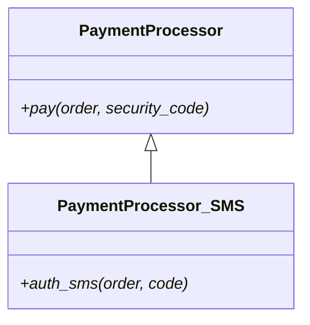
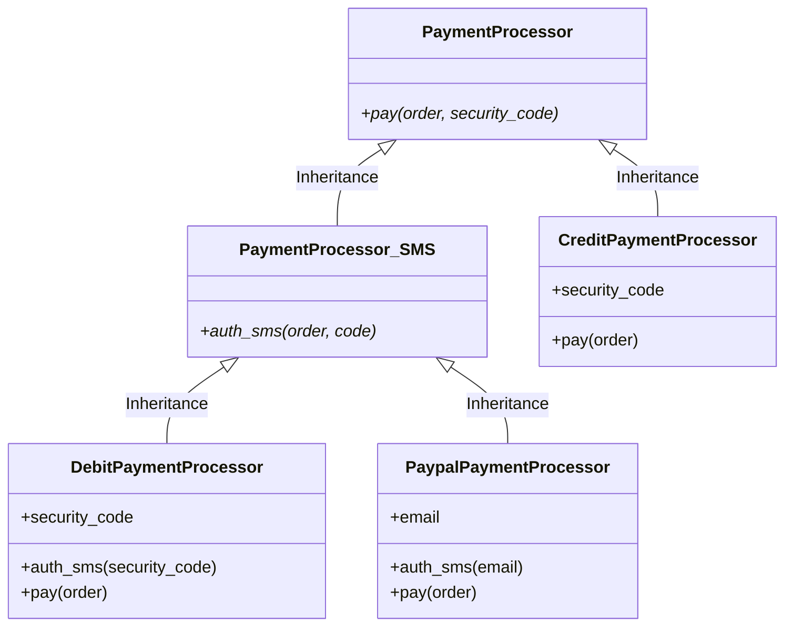
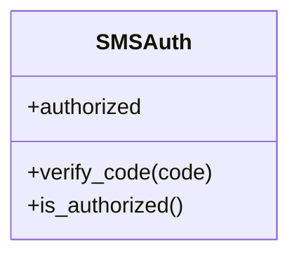
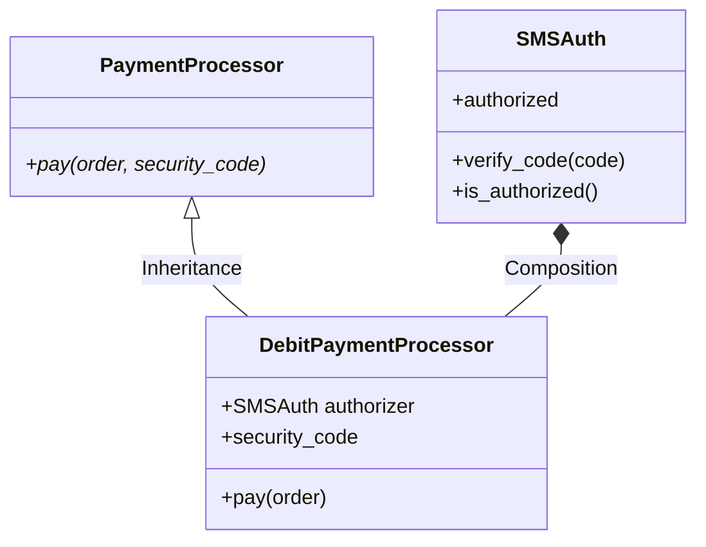
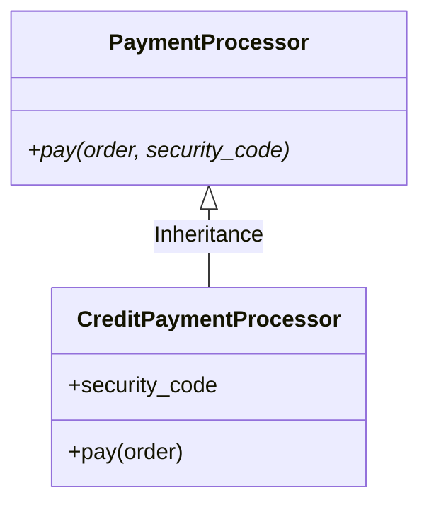
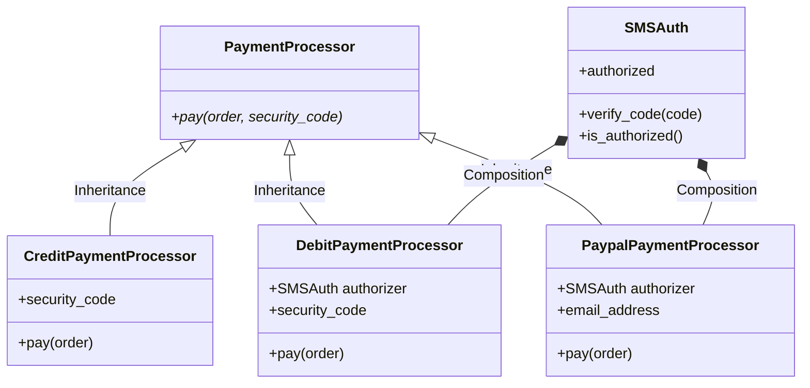

# 인터페이스 분리 원칙 (ISP)

인터페이스 분리 원칙 (ISP, Interface Segregation Principal)은 단일 책임 원칙 (SRP, Single Responsibility Principal)을 제안한 Robert Martin이 Xerox사 컨설팅 과정에서 제안한 개념입니다.


(그림 출처: [온라인 위키](https://en.wikipedia.org/wiki/Robert_C._Martin))

핵심 내용은 자신이 사용하지 않는 인터페이스는 구현하지 말아야 한다. 다시 말하면 어떤 클래스가 다른 클래스에 종속될 경우에는 최소한의 인터페이스만 사용하라는 의미입니다.

인터페이스를 작은 단위로 구분하고, 사용자는 자신이 필요한 인터페이스만 사용하도록 구현하는 것이 핵심입니다.

## ISP 실습 - 문제점 확인

이전에 우리가 사용했던 결재 시스템에서 보안 강화를 위한 SMS 인증 기능을 추가해야 하는 환경 변화가 생겼다고 가정해 보겠습니다. Two-factor Auth 기능을 더해야 하는 상황입니다.

직불(Debit) 카드, 신용(Credit) 카드, 페이팔(Paypal) 기능을 통해 결재 가능하고, 직불/페이팔은 SMS 인증이 필요하고, 신용 카드는 `security_code`만 활용하는 상황을 가정해 봅니다.

이를 해결하기 위한 단순한 방법은 클래스에 추상 메서드를 더하는 방법이 있습니다.


추상 클래스는 다음과 같은 구조가 될 것입니다.


이 클래스 다이어그램을 코딩하면 다음과 같습니다.

```python
class PaymentProcessor(ABC):
    @abstractmethod
    def auth_sms(self, code):
        pass
    @abstractmethod
    def pay(self, order):
        pass
```

추상 메서드 `auth_sms()`를 추가하여 업그레이드한 `PaymentProcessor` 클래스를 상속받아 다음과 같은 3개의 결재 방법을 구현하도록 합니다.
- DebitPaymentProcessor: 직불카드로 결재하는 클래스
- CreditPaymentProcessor: 신용카드로 결재하는 클래스
- PaypalPaymentProcessor: 페이팔로 결재하는 클래스

3개의 클래스는 다음과 같은 구조를 갖게 됩니다.


직불(Debit) 카드, 신용(Credit) 카드, 페이팔(Paypal) 기능을 각각 구현하면 다음과 같습니다. `security_code`와 관련된 추상 메서드가 없기 때문에 자식 클래스는 초기화 함수 `__init__()`를 이용해 데이터를 처리하도록 구현하였습니다.

추상 클래스를 상속받아 구현한 모든 클래스 `DebitPaymentProcessor`, `CreditPaymentProcessor`, `PaypalPaymentProcessor`에서 `auth_sms()`를 구현하였습니다.

```python
class DebitPaymentProcessor(PaymentProcessor):

    def __init__(self, security_code):
        self.security_code = security_code
        self.verified = False

    def auth_sms(self, code):
        print(f"Verifying SMS code {code}")
        self.verified = True
    
    def pay(self, order):
        if not self.verified:
            raise Exception("Not authorized")
        print("Processing debit payment type")
        print(f"Verifying security code: {self.security_code}")
        order.status = "paid"


class CreditPaymentProcessor(PaymentProcessor):

    def __init__(self, security_code):
        self.security_code = security_code

    def auth_sms(self, code):
        raise Exception("Credit card payments don't support SMS code authorization.")

    def pay(self, order):
        print("Processing credit payment type")
        print(f"Verifying security code: {self.security_code}")
        order.status = "paid"


class PaypalPaymentProcessor(PaymentProcessor):

    def __init__(self, email_address):
        self.email_address = email_address
        self.verified = False

    def auth_sms(self, code):
        print(f"Verifying SMS code: {code}")
        self.verified = True

    def pay(self, order):
        if not self.verified:
            raise Exception("Not authorized")
        print("Processing paypal payment type")
        print(f"Using email address: {self.email_address}")
        order.status = "paid"
```

지금까지 설명한 전체 구조를 클래스다이어그램으로 표현하면 다음과 같습니다.



이제는 지금까지 작성한 코드에서 문제점을 확인할 단계입니다.

신용카드 결재를 구현한 `CreditPaymentProcessor` 클래스에는 SMS 인증 기능이 필요하지 않습니다. 아래 코드 중에 `auth_sms()`를 호출하면 에러를 발생시키면서 SMS code를 지원하지 않는다는 메시지 `"Credit card payments don't support SMS code authorization."`를 출력하게 됩니다. 아래 코드를 다시한번 확인해 보세요.

```python
class CreditPaymentProcessor(PaymentProcessor):

    def __init__(self, security_code):
        self.security_code = security_code

    # 신용카드에서 지원하지 않는 SMS 인증 기능
    # 추상 메서드를 상속 받았기 때문에 반드시 구현해야 되는 상황
    def auth_sms(self, code):
        raise Exception("Credit card payments don't support SMS code authorization.")

    def pay(self, order):
        print("Processing credit payment type")
        print(f"Verifying security code: {self.security_code}")
        order.status = "paid"
```

`CreditPaymentProcessor` 클래스는 자신에게 필요하지 않은 기능을 어쩔 수 없이 구현하게 되었습니다. 이렇게 하면 ISP를 위반하게 됩니다. ISP 내용을 다시한번 써 보면 다음과 같습니다.

- 어떤 클래스가 다른 클래스에 종속될 경우에는 최소한의 인터페이스만 사용하라.
- 인터페이스를 작은 단위로 구분하고, 사용자는 자신이 필요한 인터페이스만 사용하라.

위 2가지 조건 모두 다 위반하고 있는 상황입니다. `CreditPaymentProcessor` 클래스는 불필요한 인터페이스 `auth_sms(self, code)`를 사용하기 위해 자신에게 필요하지 않은 기능을 구현하였습니다.

ISP를 위배하고 있는 문제점을 발견했으니 이제는 고쳐주면 되겠죠?

이 문제를 해결하는 방법은 상속을 통한 해결 방법과 composition 구조를 이용한 해결 방법이 가능합니다. 차근차근 알아보도록 하겠습니다.


## <a name='inheritance'></a> Inheritance 활용

기존 코드의 문제는  모든 결재 수단이 `PaymentProcessor`를 상속하고, 자신에게 필요 없는 기능까지 모두 구현하였다는 것입니다.

아래와 같이 `PaymentProcessor`에서 SMS 인증 기능을 제거하여 오직 `pay` 기능만 수행하도록 수정합니다.



파이썬으로 `PaymentProcessor` 클래스를 코딩하면 다음과 같습니다.

```python
class PaymentProcessor(ABC):

    @abstractmethod
    def pay(self, order):
        pass
```

SMS 인증 인터페이스를 정의할 클래스 `PaymentProcessor_SMS`를 새로 만듭니다. 이 때 `PaymentProcessor`를 상속하여 구현합니다. `PaymentProcessor_SMS` 구조는 다음과 같습니다.



파이썬으로 `PaymentProcessor_SMS` 클래스를 코딩하면 다음과 같습니다.

```python
class PaymentProcessor_SMS(PaymentProcessor):
    
    @abstractmethod
    def auth_sms(self, sms_code):
        pass
```

각 기능별 결재 기능을 `DebitPaymentProcessor`, `CreditPaymentProcessor`, `PaypalPaymentProcessor`로 파이썬으로 구현하면 다음과 같습니다.

상속(Inheritance)를 활용하기 위해 클래스를 다음과 같이 설계합니다.



파이썬으로 구현한 전체 코드는 다음과 같습니다.

```python
from abc import ABC, abstractmethod

class Order:

    def __init__(self):
        self.items = []
        self.quantities = []
        self.prices = []
        self.status = "open"

    def add_item(self, name, quantity, price):
        self.items.append(name)
        self.quantities.append(quantity)
        self.prices.append(price)

    def total_price(self):
        total = 0
        for i in range(len(self.prices)):
            total += self.quantities[i] * self.prices[i]
        return total


class PaymentProcessor(ABC):

    @abstractmethod
    def pay(self, order):
        pass


class PaymentProcessor_SMS(PaymentProcessor):
    
    @abstractmethod
    def auth_sms(self, sms_code):
        pass


class DebitPaymentProcessor(PaymentProcessor_SMS):

    def __init__(self, security_code):
        self.security_code = security_code
        self.verified = False

    def auth_sms(self, code):
        print(f"Verifying SMS code: {code}")
        self.verified = True
    
    def pay(self, order):
        if not self.verified:
            raise Exception("Not authorized")
        print("Processing debit payment type")
        print(f"Verifying security code: {self.security_code}")
        order.status = "paid"


class CreditPaymentProcessor(PaymentProcessor):

    def __init__(self, security_code):
        self.security_code = security_code

    # def auth_sms(self, code):
    #     raise Exception("Credit card payments don't support SMS code authorization.")

    def pay(self, order):
        print("Processing credit payment type")
        print(f"Verifying security code: {self.security_code}")
        order.status = "paid"


class PaypalPaymentProcessor(PaymentProcessor_SMS):

    def __init__(self, email_address):
        self.email_address = email_address
        self.verified = False

    def auth_sms(self, code):
        print(f"Verifying SMS code: {code}")
        self.verified = True

    def pay(self, order):
        if not self.verified:
            raise Exception("Not authorized")
        print("Processing paypal payment type")
        print(f"Using email address: {self.email_address}")
        order.status = "paid"


order = Order()
order.add_item("Keyboard", 1, 50)
order.add_item("SSD", 1, 150)
order.add_item("USB cable", 2, 5)

print(order.total_price())

processor1 = DebitPaymentProcessor("1234")
processor1.auth_sms('1234')
processor1.pay(order)

processor2 = CreditPaymentProcessor("5678")
processor2.pay(order)

processor3 = PaypalPaymentProcessor("abc@company.com")
processor3.auth_sms("abc@company.com")
processor3.pay(order)
```

## Composition 활용

ISP 위반을 해결하기 위한 다른 방법은 Composition(합성)을 이용하는 방법입니다.
Composition은 여러 개 클래스를 활용하여 새로운 클래스를 완성하는 기법입니다.

Composition 관계에서는 부분 객체가 전체 객체에 완전하게 속하게 되며 전체 객체가 사라지면 부분 객체도 모두 함께 사라지는 관계를 의미합니다. 여기서 전체 객체는 다른 객체의 기능을 사용하는 객체이고, 부분 객체는 전체 객체에 의해 사용되는 객체입니다.

참고로 Aggregation(집합) 관계도 있습니다. Aggregation 관계는 한 객체가 다른 객체를 포함하는 관계입니다. 이때 부분 객체는 다른 객체와 공유할 수 있습니다. Composition 관계와는 다르게 전체 객체가 사라지더라도 부분 객체는 사라지지 않아도 됩니다(전체 객체와 부분 객체의 Life Time은 독립적임).

우리는 위에서 설명한 바와 같이 간단하게 개념만 짚고 넘어가도록 하겠습니다. 보다 구체적인 내용은 SW공학 전문 서적을 참고하기 바랍니다.

Compositon을 활용하기 위해 `PaymentProcessor`는 지불 `pay()` 기능(메서드)만 담당하도록 수정하겠습니다. 
[Inheritance(상속)](#inheritance)에서 살펴본 구조와 동일합니다.


파이썬으로 `PaymentProcessor` 클래스를 코딩하면 다음과 같습니다.

```python
class PaymentProcessor(ABC):

    @abstractmethod
    def pay(self, order):
        pass
```

Composition(합성) 구조를 사용하기 위한 새로운 클래스 `SMSAuth`를 만듭니다. `SMSAuth` 클래스는 SMS 인증 기능만 담당하도록 구현합니다. 파이썬으로 구현한 코드는 다음과 같습니다.



파이썬으로 `SMSAuth` 클래스를 코딩하면 다음과 같습니다.

```python
    class SMSAuth:
        def __init__(self):
            self.authorized = False

        def verify_code(self, code):
            print(f'Verifying code: {code}')
            self.authorized = True
        
        def is_authorized(self,):
            return self.authorized
```

결재 방법에 따른 개별 클래스를 구현합니다. 
먼저 직불카드 결재를 담당하는 `DebitPaymentProcessor` 클래스를 구현해 봅니다.
직불카드는 결재와 SMS 인증이 모두 필요합니다. 지불 기능은 `PaymentProcessor` 클래스를 상속 받아 구현하고, SMS 인증 기능은 생성자 함수 `__init__()` 활용하여 부분 객체로 생성합니다.

`DebitPaymentProcessor` 클래스의 구조는 다음과 같습니다.



`DebitPaymentProcessor` 클래스를 파이썬으로 구현하면 다음과 같습니다.

```python
class DebitPaymentProcessor(PaymentProcessor):

    def __init__(self, security_code, authorizer: SMSAuth):
        self.authorizer = authorizer
        self.security_code = security_code
        
    def pay(self, order):
        if not self.authorizer.is_authorized():
            raise Exception("Not authorized")
        print("Processing debit payment type")
        print(f"Verifying security code: {self.security_code}")
        order.status = "paid"
```

페이팔 결재를 담당하는 `PaypalPaymentProcessor` 클래스도 SMS 인증 기능이 필요합니다. 클래스 구조는 생성자로 가지고 있는 변수 `email_address`만 다르고 나머지는 `DebitPaymentProcessor` 클래스와 동일합니다. 

`PaypalPaymentProcessor` 클래스의 구조는 다음과 같습니다.


`PaypalPaymentProcessor` 클래스를 파이썬으로 구현하면 다음과 같습니다.

```python
class PaypalPaymentProcessor(PaymentProcessor):

    def __init__(self, email_address, authorizer: SMSAuth):
        self.authorizer = authorizer
        self.email_address = email_address

    def pay(self, order):
        if not self.authorizer.is_authorized():
            raise Exception("Not authorized")
        print("Processing paypal payment type")
        print(f"Using email address: {self.email_address}")
        order.status = "paid"
```

신용카드 결재를 담당하는 `CreditPaymentProcessor` 경우는 SMS 인증이 필요하지 않습니다. 따라서 `PaymentProcessor` 상속하고 클래스 내부에 부분 클래스 `SMSAuth` 클래스를 갖지 않도록 구현합니다. [Inheritance(상속)](#inheritance)에서 살펴본 `CreditPaymentProcessor` 클래스 구조와 같습니다.

`CreditPaymentProcessor` 클래스 구조는 다음과 같습니다.



`CreditPaymentProcessor` 클래스를 파이썬으로 구현하면 다음과 같습니다.

```python
class CreditPaymentProcessor(PaymentProcessor):

    def __init__(self, security_code):
        self.security_code = security_code

    def pay(self, order):
        print("Processing credit payment type")
        print(f"Verifying security code: {self.security_code}")
        order.status = "paid"

```

Compositon(합성)을 이용한 전체 구조는 다음과 같습니다.



Composition(합성) 이용한 파이썬으로 구현한 전체 코드는 다음과 같습니다.

```python
from abc import ABC, abstractmethod

class Order:

    def __init__(self):
        self.items = []
        self.quantities = []
        self.prices = []
        self.status = "open"

    def add_item(self, name, quantity, price):
        self.items.append(name)
        self.quantities.append(quantity)
        self.prices.append(price)

    def total_price(self):
        total = 0
        for i in range(len(self.prices)):
            total += self.quantities[i] * self.prices[i]
        return total


class PaymentProcessor(ABC):

    @abstractmethod
    def pay(self, order):
        pass


class SMSAuth:
    def __init__(self):
        self.authorized = False

    def verify_code(self, code):
        print(f'Verifying code: {code}')
        self.authorized = True
    
    def is_authorized(self,):
        return self.authorized


class DebitPaymentProcessor(PaymentProcessor):

    def __init__(self, security_code, authorizer: SMSAuth):
        self.authorizer = authorizer
        self.security_code = security_code
        
    def pay(self, order):
        if not self.authorizer.is_authorized():
            raise Exception("Not authorized")
        print("Processing debit payment type")
        print(f"Verifying security code: {self.security_code}")
        order.status = "paid"


class CreditPaymentProcessor(PaymentProcessor):

    def __init__(self, security_code):
        self.security_code = security_code

    def pay(self, order):
        print("Processing credit payment type")
        print(f"Verifying security code: {self.security_code}")
        order.status = "paid"


class PaypalPaymentProcessor(PaymentProcessor):

    def __init__(self, email_address, authorizer: SMSAuth):
        self.authorizer = authorizer
        self.email_address = email_address

    def pay(self, order):
        if not self.authorizer.is_authorized():
            raise Exception("Not authorized")
        print("Processing paypal payment type")
        print(f"Using email address: {self.email_address}")
        order.status = "paid"


order = Order()
order.add_item("Keyboard", 1, 50)
order.add_item("SSD", 1, 150)
order.add_item("USB cable", 2, 5)

print(order.total_price())

# Debit payment
processor_debit = DebitPaymentProcessor('1234', SMSAuth())
processor_debit.authorizer.verify_code('1234')
processor_debit.pay(order)

# Credit payment
processor_credit = CreditPaymentProcessor('5678')
processor_credit.pay(order)

# Paypal payment
processor_paypal = PaypalPaymentProcessor('abc@company.com', SMSAuth())
processor_paypal.authorizer.verify_code('abc@company.com')
processor_paypal.pay(order)
```

SOLID 튜토리얼 메인 페이지로 돌아가기 [Click](../README.md)