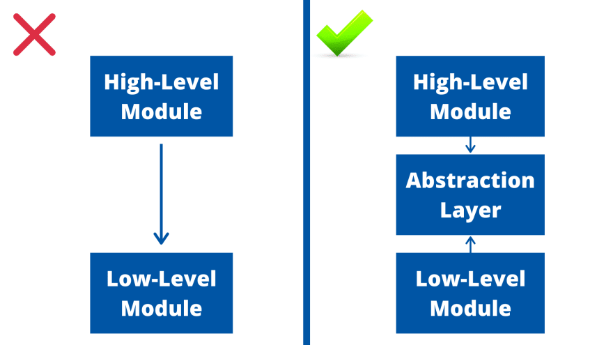

# 의존관계 역전 원칙 (DIP)

의존관계 역전 원칙 (DIP: Dependency Inversion Principle) 원칙은 '클라이언트는 구체 클래스가 아닌 추상 클래스(인터페이스)에 의존해야 한다는 원칙입니다. 앞으로는 의존관계 역전 원칙은 간단히 DIP로 부르도록 하겠습니다. 구체적으로는 다음과 같이 말할 수 있습니다. 

1. High level modules should not depend upon low level modules. Both should depend upon abstractions. 상위 모듈은 하위 모듈에 의존해서는 안됩니다. 상위/하위 모듈 모두 추상화에 의존해야 합니다.
2. Abstractions should not depend upon details. Details should depend upon abstractions. 추상화는 세부 사항에 의존해서는 안된다. 세부사항은 추상화에 의존해야 한다.

의존(Dependency) 관계에 대한 보다 자세한 설명은 [연관 및 의존관계 비교](./relationship-association-vs-dependency.md)를 참고하기 바랍니다.

일단 잃어보긴 했지만 여전히 무슨 의미인지 해석하기 어렵습니다.

보다 쉽게 설명하자면, 클래스 사이에서 의존관계를 맺을 때는 쉽게 변하는 것 보다는 변화가 없는 것 (또는 변하기 어려운 것)에 의존하라는 의미입니다.

쉽게 설명한다고 했지만 여전히 어렵습니다. 

`전구 스위치` 예제를 가지고 설명하겠습니다. 아래 그림과 같은 전구 스위치가 있다고 가정해 보겠습니다.


우리 예제에서 사용하는 전구는 다음과 같은 특징이 있습니다.
- 작동 방식
    - 스위치가 `On` 상태이면, 전구에 불이 들어옵니다.
    - 스위치가 `Off` 상태이면, 전구 불이 꺼집니다.
    - 스위치는 누를 때마다 `On` 과 `Off` 상태를 왔다 갔다 합니다.
- 전구
    - `turn_on()` : 전기를 켜는 기능 (메서드)
    - `turn_off()` : 전기를 끄는 기능 (메서드)
- 스위치
    - `status`: 전구 상태를 표시하는 변수 (속성, 멤버 변수)
    - `push()` : 스위치 버튼을 누르는 기능(메서드)
        - 스위치가 `Off` 상태에서 누르면  `status` 가 `On`로 변경됩니다.
        - 스위치가 `On`(들어간) 상태에서 누르면 튀어나오면서 `status` 가 `Off`로 변경됩니다.


우선 전구 클래스 `Light`는 다음과 같은 구조를 갖게 될 것입니다.


`Light` 클래스를 파이썬으로 구현하면 다음과 같습니다.

```python
class Light:
    
    def turn_on(self,):
        print('전구: 전원이 켜졌습니다.')
    
    def turn_off(self,):
        print('전구: 전원이 꺼졌습니다.')
```

이제 스위치 클래스 `Switch`는 어떨지 살펴보겠습니다.

스위치를 상태 `status`가 변할 때마다 전구 클래스 `Light`를 호출하여 전구가 켜지거나 꺼지도록 구현하면 될 것 같습니다.

스위치 클래스 `Switch` 구조는 다음과 같이 구현할 수 있습니다.


스위치 클래스 `Switch`를 파이썬으로 구현하면 다음과 같습니다.

```python
class Switch:
    '''스위치 클래스'''
    
    def __init__(self, status: bool = False) -> None:
        self.switch_on = status
    
    def push(self, light: Light):
        '''전구 on/off를 제어하는 메서드'''
        if self.switch_on:
            light.turn_off()
            self.switch_on = False
        else:
            light.turn_on()
            self.switch_on = True
```

실행하기 위한 코드는 다음과 같습니다.

```python
light = Light() # 전구 객체 생성
switch = Switch(status=False) # 스위치 객체 생성
switch.push(light) # 스위치 1번 누름: off -> on
switch.push(light) # 스위치 1번 누름: on -> off
```

현재까지 구현한 내용 전체를 파이썬으로 구현하면 다음과 같습니다.

```python
class Light:
    '''전구 클래스'''    
    
    def turn_on(self,):
        print('Light: 전원이 켜졌습니다.')
    
    def turn_off(self,):
        print('Light: 전원이 꺼졌습니다.')


class Switch:
    '''스위치 클래스'''
    
    def __init__(self, status: bool = False) -> None:
        self.switch_on = status
    
    def push(self, light: Light):
        '''전구 on/off를 제어하는 메서드'''
        if self.switch_on:
            light.switch_on()
            self.switch_on = False
        else:
            light.turn_off()
            self.light_on = True

if __name__=='__main__': 
    light = Light() # 전구 객체 생성
    switch = Switch(status=False) # 스위치 객체 생성
    switch.push(light) # 스위치 1번 누름: off -> on
    switch.push(light) # 스위치 1번 누름: on -> off
```

## 환경 변화 - 클래스 추가

위 코드에서는 스위치로 제어할 대상이 전구 하나 뿐이었습니다.
그런데 개발환경이 바뀌어서 선풍기를 구현해야 할 일이 발생했습니다.
선풍기 기능을 살펴보니 전구와 마찬가지로 `On` / `Off` 기능을 담당하는 스위치를 가지고 제어하는 구조였습니다.

우선 선풍기 클래스 `Fan` 구조를 전구 클래스 `Light`와 유사하게 구현합니다.


이미 구현해 놓은 `Switch` 클래스가 있으니 "재활용 하면 되겠구나!" 라고 생각했습니다.
`press()` 메서드에서 `Light` 클래스의 객체를 파라미터로 전달받는 구조에서 임의의 객체를 전달받을 수 있도록 수정하였습니다.


위 클래스 다이어그램을 파이썬으로 구현하면 다음과 같습니다.

```python
class Light:
    '''전구 클래스'''    
    
    def turn_on(self,):
        print('전구: 전원이 켜졌습니다.')
    
    def turn_off(self,):
        print('전구: 전원이 꺼졌습니다.')


class Fan:
    '''선풍기 클래스'''
    
    def turn_on(self,):
        print('선풍기: 선풍기가 돌아갑니다.')
    
    def turn_off(self,):
        print('선풍기: 선풍기가 멈춥니다.')


class Switch:
    '''스위치 클래스'''
    
    def __init__(self, status: bool = False) -> None:
        self.switch_on = status
    
    def push(self, obj: object):
        '''전구 on/off를 제어하는 메서드'''
        if self.switch_on:
            obj.turn_off()
            self.switch_on = False
        else:
            obj.turn_on()
            self.switch_on = True
```

위 코드를 실행하는 파이썬 코드는 다음과 같습니다.

```python
light = Light() # 전구 객체 생성
fan = Fan() # 선평기 객체 생성
switch = Switch(status=False) # 스위치 객체 생성

# 전구 제어
switch.push(light) # 스위치 1번 누름: 전구 off -> on
switch.push(light) # 스위치 1번 누름: 전구 on -> off

# 선풍기 제어
switch.push(fan) # 스위치 1번 누름: 선풍기 off -> on
switch.push(fan) # 스위치 1번 누름: 선풍기 on -> off
```

현재까지 소스코드 파일은 [여기](../05_02_solid_dip_intermediate.py)를 참고하기 바랍니다.

## 문제점 확인

위 코드의 문제점을 살펴 볼까요?

위 코드에서 `Light`, `Fan` 클래스는 `Switch` 클래스가 어떤 일을 하는지 전혀 알지 못합니다. 각각의 클래스는 그저 `turn_on()`, `turn_off()` 기능만 수행하면 그만입니다. 여기서 2가지 경우를 생각해 볼 수 있습니다.

1. `Light`, `Fan` 클래스가 변경되는 경우
    - 이 2개의 클래스를 사용(의존)하고 있는 `Switch` 클래스를 변경해야 합니다.
    - `Switch` 클래스를 적절히 변경하지 않는다면 오류가 발생할 확률이 높아집니다.
2. `Switch` 클래스가 변경되는 경우
    - `Light`, `Fan` 클래스에 어떤 영향도 주지 않습니다.

여기서 알 수 있는 것은 `Switch` 클래스가 저수준에 의존하기 보다는 구체화된 고수준 클래스에 의존하고 있다는 것입니다.

조금 더 구체적으로 알아보면 다음과 같습니다.

`Light`, `Fan` 클래스는 `turn_on()`, `turn_off()` 기능이라는 저수준의 기능을 공통적으로 가지고 있습니다. 2가지 기능은 항상 필요한 것입니다. 필요에 따라서 항상 필요한 기능 이외에 각각의 클래스에 필요한 기능을 추가할 수 있습니다. 

DIP 원칙의 핵심인 `추상화에 의존해야지 구체화에 의존하면 안된다` 라는 원칙을 위반하고 있습니다.

따라서 `Switch` 클래스는 기능이 구체화된 클래스보다는 변하지 않는 기능에 의존해야 합니다. 
`Light`, `Fan` 클래스가 어떻게 변하더라도 변화가 없는 `turn_on()`, `turn_off()` 기능에 의존하도록 구현해야 됩니다.

그림으로 표현하면 다음과 같습니다.



이미지 출처: [Why The Dependency Inversion Principle Is Worth Using](https://dev.to/huzaifa99/why-the-dependency-inversion-principle-is-worth-using-opj)

그렇다면 어떻게 해야 할까요?

`turn_on()`, `turn_off()` 기능을 부여하는 추상클래스를 만들고 고수준 `Switch` 클래스가 해당 추상 클래스에 의존하도록 구현하면 됩니다. 다시 말해 `의존 관계를 역전` 시키도록 구현하면 된다는 의미입니다.

자바 언어의 경우는 `abstract class` 라는 키워드를 이용해 구현하면 됩니다. 파이썬 언어의 경우 이러한 키워드가 없어 직접 추상 클래스를 구현할 수 없습니다. 다행히 파이썬 언어는 `ABC` 클래스를 지원하고 있습니다. 이를 활용하면 쉽게 추상 클래스를 구현할 수 있습니다.

`Switch` 클래스는 `turn_on()`, `turn_off()` 기능을 지원하는 추상 클래스에 의존하도록 하고, `Light`, `Fan` 클래스는 추상 클래스를 상속받아 구체화 하도록 구현합니다. 이런 구조를 클래스 다이어그램으로 표현하면 다음과 같습니다.


## 문제 해결

먼저 추상 클래스 `SwitchCore`를 파이썬으로 구현하면 다음과 같습니다.

```python
from abc import ABC, abstractmethod

class SwitchCore(ABC):
    @abstractmethod
    def turn_on(self,):
        pass

    @abstractmethod
    def turn_off(self,):
        pass
```

추상 클래스를 상속받아 `Light`, `Fan` 클래스를 각각 구체화 합니다.

```python
class Light(SwitchCore):
    '''추상 클래스 SwitchCore를 상속받아 
    전구 클래스 구체화'''    
    
    def turn_on(self,):
        print('전구: 전원이 켜졌습니다.')
    
    def turn_off(self,):
        print('전구: 전원이 꺼졌습니다.')


class Fan(SwitchCore):
    '''추상 클래스 SwitchCore를 상속받아 
    선풍기 클래스 구체화'''
    
    def turn_on(self,):
        print('선풍기: 선풍기가 돌아갑니다.')
    
    def turn_off(self,):
        print('선풍기: 선풍기가 멈춥니다.')
```

변경 가능성이 낮은 추상 클래스 `SwitchCore` 를 활용하도록 `Switch` 클래스 수정합니다.

```python
class Switch:
    '''스위치 클래스'''
    
    def __init__(self, status: bool = False) -> None:
        self.switch_on = status
    
    def push(self, obj: SwitchCore):
        '''전구 on/off를 제어하는 메서드'''
        if self.switch_on:
            obj.turn_off()
            self.switch_on = False
        else:
            obj.turn_on()
            self.switch_on = True
```

이와 같은 방법을 사용하면 `Switch` 클래스는 변하지 않는 `turn_on()`, `turn_off()` 기능을 선언한 추상 클래스 `SwitchCore` 에 의존하게 되므로 `Light`, `Fan` 클래스가 어떻게 구현되더라도 또는, 어떤 기능이 추가되더라도 항상 작동하게 됩니다. 

게다가 `Light`, `Fan` 클래스의 세부적인 구현 내용이 변경되더라도 `Switch` 클래스는 전혀 영향을 받지 않게 됩니다.

의존관계가 역전되도록 수정한 파이썬 코드를 실행하는 방법은 동일합니다.

```python
light = Light() # 전구 객체 생성
fan = Fan() # 선평기 객체 생성
switch = Switch(status=False) # 스위치 객체 생성

# 전구 제어
switch.push(light) # 스위치 1번 누름: 전구 off -> on
switch.push(light) # 스위치 1번 누름: 전구 on -> off

# 선풍기 제어
switch.push(fan) # 스위치 1번 누름: 선풍기 off -> on
switch.push(fan) # 스위치 1번 누름: 선풍기 on -> off
```

DIP 원칙이 적용된 소스코드 파일은 [여기](../05_03_solid_dip_after.py)를 참고하기 바랍니다.

전체 소스코드는 다음과 같습니다.

```python
from abc import ABC, abstractmethod

class SwitchCore(ABC):
    @abstractmethod
    def turn_on(self,):
        pass

    @abstractmethod
    def turn_off(self,):
        pass

class Light(SwitchCore):
    '''추상 클래스 SwitchCore를 상속받아 
    전구 클래스 구체화'''    
    
    def turn_on(self,):
        print('전구: 전원이 켜졌습니다.')
    
    def turn_off(self,):
        print('전구: 전원이 꺼졌습니다.')


class Fan(SwitchCore):
    '''추상 클래스 SwitchCore를 상속받아 
    선풍기 클래스 구체화'''
    
    def turn_on(self,):
        print('선풍기: 선풍기가 돌아갑니다.')
    
    def turn_off(self,):
        print('선풍기: 선풍기가 멈춥니다.')


class Switch:
    '''스위치 클래스'''
    
    def __init__(self, status: bool = False) -> None:
        self.switch_on = status
    
    def push(self, obj: SwitchCore):
        '''전구 on/off를 제어하는 메서드'''
        if self.switch_on:
            obj.turn_off()
            self.switch_on = False
        else:
            obj.turn_on()
            self.switch_on = True

if __name__=='__main__': 
    light = Light() # 전구 객체 생성
    fan = Fan() # 선평기 객체 생성
    switch = Switch(status=False) # 스위치 객체 생성
    
    # 전구 제어
    switch.push(light) # 스위치 1번 누름: 전구 off -> on
    switch.push(light) # 스위치 1번 누름: 전구 on -> off

    # 선풍기 제어
    switch.push(fan) # 스위치 1번 누름: 선풍기 off -> on
    switch.push(fan) # 스위치 1번 누름: 선풍기 on -> off
```

SOLID 튜토리얼 메인 페이지로 돌아가기 [Click](../README.md)