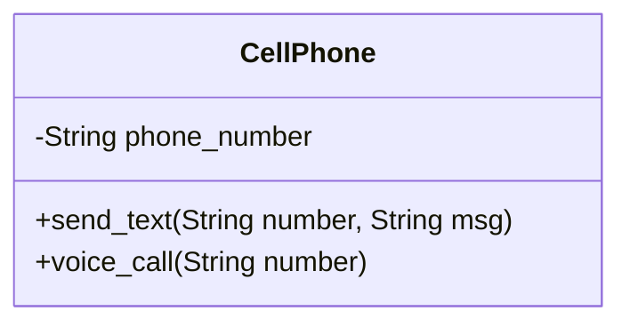
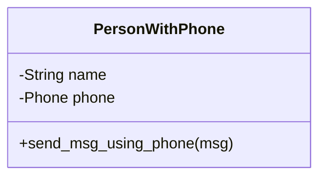
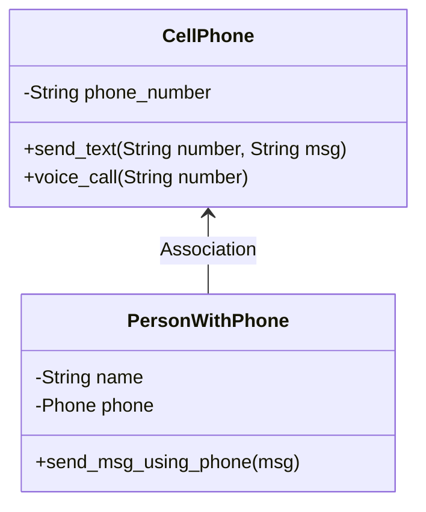
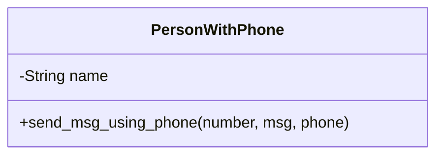
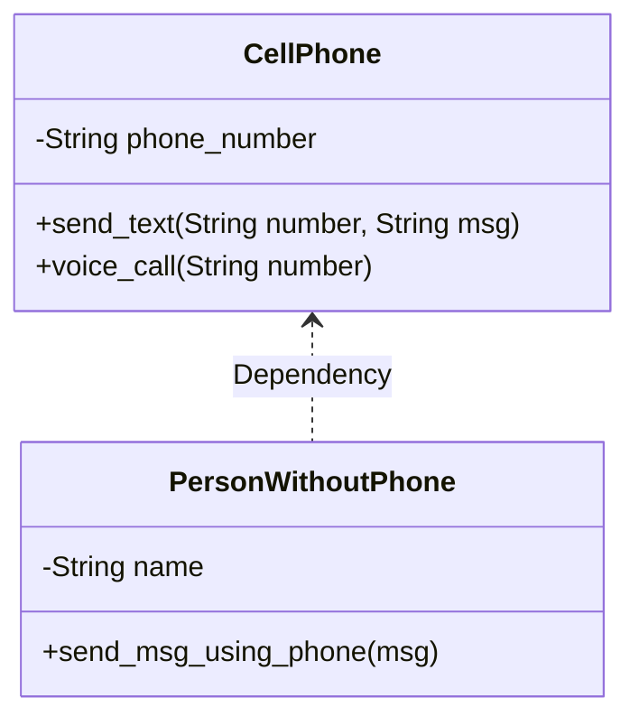

# 연관 관계 vs. 의존 관계

소프트웨어 공학에서 클래스간의 관계(relation)를 표현하는 것 중에서 대표적인 것으로 `연관(association) 관계`와 `의존(dependency) 관계`라는 것이 있습니다.

두 관계는 명칭도 헷갈리고, 실제 의미도 구분하기 어렵습니다.

이번 장(chapter)에서는 연관 및 의존 관계에 대해 쉽게 설명해 드리고자 합니다.
- 공통점: 하나의 클래스에서 다른 클래스의 기능을 사용합니다.
- 차이점: 여러가지 측면으로 설명할 수 있습니다.


|구분|연관(association)|의존(dependency)|
|:---|:---|:---|
|개념|하나의 클래스가 다른 클래스의 기능을 소유|하나의 클래스가 다른 클래스의 기능을 잠시 사용|
|시간적 특징|관계 유지 기간이 깁니다.|관계 유지 기간이 매우 짧습니다.|
|유지 기간|클래스의 객체가 존재하는 한 관계 지속|일시적으로 관계가 형성되고 필요가 없으면 사라짐|
|생성 시점|Class가 인스턴스화 되는 시점|클래스 인스턴스가 생성된 된 이후 메서드 호츨(call)이 발생하는 시점|
|존재 형태|클래스의 속성(또는 멤버 변수)로 존재|클래스의 메소드 내에서서 일시적으로 생성|
|코딩 방법|생성자를 통해 클래스 속성(멤버 변수)로 구현|사용하고자 하는 클래스를 메서드의 파라미터(변수) 또는 리턴값으로 구현|
|UML 표시|$\to$ (직선 화살표)|$\dashrightarrow$ (점선 화살표)|
||||


`사람`과 `휴대폰`의 관계를 예로 들어보도록 하겠습니다. 사람과 휴대폰이 관계를 형성하는 경우를 2가지로 생각할 수 있습니다.

1. 어떤 사람은 자신의 휴대폰을 소유하고 있습니다. 그 사람은 언제든지 휴대폰의 기능을 사용할 수 있을 것입니다.
2. 어떤 사람은 휴대폰이 없습니다. 이 사람은 휴대폰을 빌려서 휴대폰 기능을 사용할 수 있습니다.

우선 휴대폰 클래스 구현의 편의를 위해 휴대폰은 문자 전송(`send_text()`) 기능과 음성통화(`voice_call()`) 기능만 갖는다고 가정하겠습니다. 휴대폰을 클래스로 구현한다면 다음과 같은 구조가 될 것입니다. 



휴대폰을 파이썬으로 구현하면 다음과 같습니다.

```python
class CellPhone:
    '''휴대폰 클래스'''

    def __init__(self, phone_number: str) -> None:
        self.phone_number: str = phone_number

    def send_text(self, number: str, msg: str):
        '''저정한 전화번호(number)로 문자메시지(msg) 전송'''
        print(f'{number}님께 문자 전송: {msg}')

    def voice_call(self, number: str):
        '''지정한 전화번호(number)로 음성통화'''
        print(f'{number}님과 음성통화가 연결되었습니다.')
```

이제는 사람을 구현할 차례입니다. 간단하게 휴대폰을 소유한 사람 클래스 `PersonWithPhone`과 휴대폰이 없어서 빌려쓰는 사람 클래스 `PersonWithoutPhone` 클래스로 나누어 구현하도록 하겠습니다. 

우리 예제에서 `PersonWithPhone`는 `연관(Association)` 관계에 해당합니다. `PersonWithoutPhone` 클래스는 `의존(Depencency)` 관계에 해당합니다. 휴대폰 클래스 `CellPhone`은 어떤 경우든 변경 없이 공통적으로 사용합니다. 두 가지를 나누어서 설명하겠습니다.

## 연관(Association) 관계

연관 관계에 해당하는 것은 사용하려는 클래스의 객체를 클래스의 멤버 변수로 지정하면 됩니다.

`PersonWithPhone` 클래스 구조는 다음과 같습니다.



`PersonWithPhone` 클래스 내부에 `Phone` 이라는 객체를 멤버 변수로 가지고 있습니다. 즉, 2개의 클래스는 `연관(Association)` 관계를 갖게 됩니다. 이 구조를 표현하면 다음과 같습니다.




 `PersonWithPhone` 클래스를 파이썬으로 구현하면 다음과 같습니다.

 ```python
 class PersonWithPhone():
    '''휴대폰을 소유한 사람'''

    def __init__(self, name:str, phone: CellPhone) -> None:
        self.name: str = name
        self.phone: CellPhone = phone

    def send_msg_using_phone(self, number: str, msg: str):
        '''자신이 소유한 휴대폰을 사용하여 문자 발송 '''
        self.phone.send_text(number, msg)
 ```

 `PersonWithPhone` 클래스를 실행하는 파이썬 코드는 다음과 같습니다.

 ```python
phone = CellPhone('010-1234-5555')
person_with_phone = PersonWithPhone('Hong Gil Dong', phone)
person_with_phone.send_msg_using_phone('010-1234-9999', 'Hello world')
```

위 코드를 실행하면 다음과 같은 결과가 출력됩니다.

```bash
(venv)path/to/your/directory$ 010-1234-9999님께 문자 전송: Hello world
```

앞에서 살펴본 바와 같이  `PersonWithPhone` 클래스는 객체를 생성하는 순간(인스턴스화 되는 시점)에서 `CellPhone` 클래스를 멤버 변수로 갖게 되며 객체가 소명하지 않는 이상 `CellPhone` 클래스 기능을 언제든지 활용할 수 있습니다.

## 의존(Dependency) 관계

앞에서 설명한 바와 같이 의존 관계는 이용하려는 클래스의 기능이 있을 경우 때에 따라서 호출해서 사용하는 방법입니다. 실습을 통해 공부해 보도록 하겠습니다.

우선 휴대폰 클래스 `CellPhone`는 변경 없이 그대로 사용합니다(변경 사항 없습니다).

휴대폰이 없어서 필요할 때마다 휴대폰을 빌려 사용하는 사람을 `PersonWithoutPhone` 클래스로 구현하면 클래스 구조는 다음과 같습니다.

`PersonWithoutPhone` 클래스 구조는 다음과 같습니다.



위 클래스 다이어그램에서와 같이 `PersonWithoutPhone` 클래스는 멤버 변수로 `CellPhone` 클래스를 갖지 않습니다. 다만 `send_msg_using_phone()` 메서드에서 `CellPhone` 객체를 파라미터로 전달받아 메시지를 전송할 수 있습니다.

위 상황을 파이썬으로 구현하면 다음과 같습니다.

```python
class PersonWithoutPhone():
    '''휴대폰이 없어서 빌려쓰는 사람'''
    def __init__(self, name:str) -> None:
        self.name: str = name
    
    def send_msg_using_phone(self, number: str, msg: str, phone: CellPhone):
        '''휴대폰을 빌려서 문자 발송 '''
        phone.send_text(number, msg)
```

의존(Dependency) 관계는 점선 화살표로 $\dashrightarrow$ 표현한다고 했습니다.
이를 클래스 다이어그램으로 표현하면 다음과 같습니다.



`PersonWithoutPhone` 클래스를 실행하는 파이썬 코드는 다음과 같습니다.

```python
phone = CellPhone('010-5555-6789')
persson_without_phone = PersonWithoutPhone('Hong Gil Dong')
persson_without_phone.send_msg_using_phone('010-1234-9999', 'Hello world', phone)
```

## 전체 코드

지금까지 살펴본 연관(Association) 및 의존(Dependency) 관계를 전체 코드는 다음과 같습니다.

원본 소스 코드는 [여기](../relationship_association_vs_dependency.py)에서 확인할 수 있습니다.

```python
'''연관(Association) 및 의존(Depencency) 관계의 차이점 설명합니다.'''

class CellPhone:
    '''휴대폰 클래스'''

    def __init__(self, phone_number: str) -> None:
        self.phone_number: str = phone_number

    def send_text(self, number: str, msg: str):
        '''저정한 전화번호(number)로 문자메시지(msg) 전송'''
        print(f'{number}님께 문자 전송: {msg}')

    def voice_call(self, number: str):
        '''지정한 전화번호(number)로 음성통화'''
        print(f'{number}님과 음성통화가 연결되었습니다.')


class PersonWithPhone():
    '''휴대폰을 소유한 사람'''

    def __init__(self, name:str, phone: CellPhone) -> None:
        self.name: str = name
        self.phone: CellPhone = phone

    def send_msg_using_phone(self, number: str, msg: str):
        '''자신이 소유한 휴대폰을 사용하여 문자 발송 '''
        self.phone.send_text(number, msg)


class PersonWithoutPhone():
    '''휴대폰이 없어서 빌려쓰는 사람'''
    def __init__(self, name:str) -> None:
        self.name: str = name
    
    def send_msg_using_phone(self, number: str, msg: str, phone: CellPhone):
        '''휴대폰을 빌려서 문자 발송 '''
        phone.send_text(number, msg)
    

if __name__=='__main__':
    phone = CellPhone('010-1234-5555')
    person_with_phone = PersonWithPhone('Hong Gil Dong', phone)
    person_with_phone.send_msg_using_phone('010-1234-9999', 'Hello world')

    phone = CellPhone('010-5555-6789')
    persson_without_phone = PersonWithoutPhone('Hong Gil Dong')
    persson_without_phone.send_msg_using_phone('010-1234-9999', 'Hello world', phone)
```
